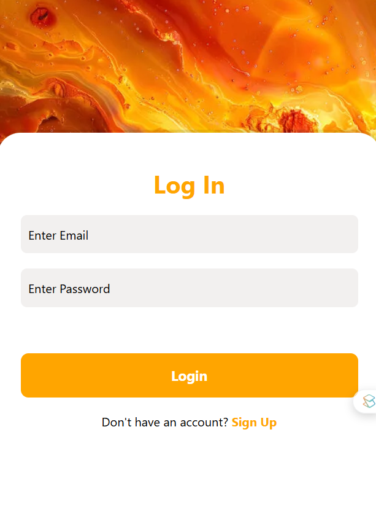
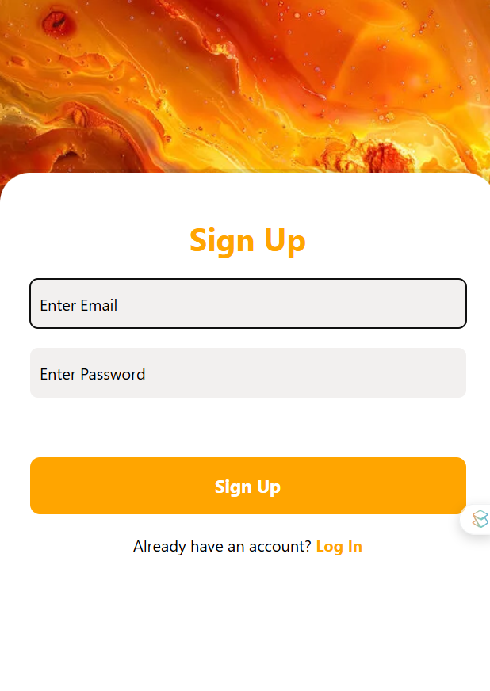
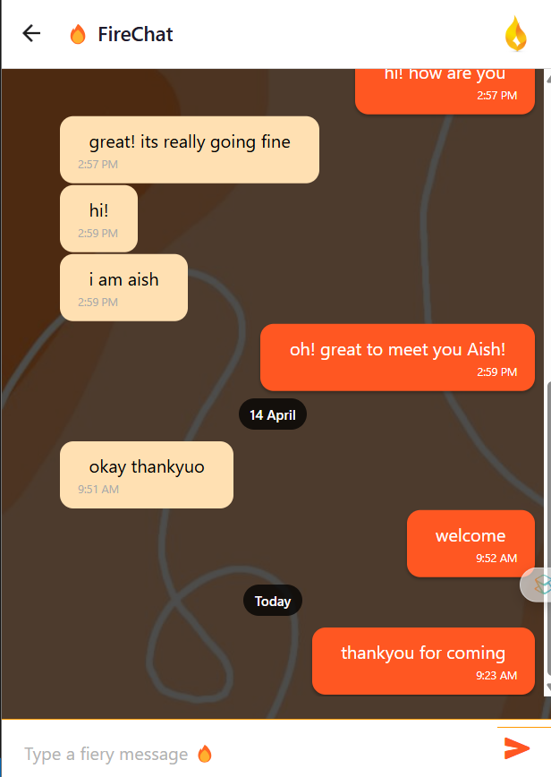

# 🔥 FireChat

**FireChat** is a beautiful and minimal real-time chat app built with **React Native**, using **Firebase Authentication** for login/signup and **Cloud Firestore** for real-time messaging. This app features clean navigation and a fire-themed UI for a stunning user experience.

---

## ✨ Features

- 🔐 Firebase Authentication (Signup, Login, Logout)
- 💬 Real-time messaging with Firebase Firestore
- 🎨 Custom UI with a fire theme
- 📱 React Navigation for smooth screen transitions
- 🧠 Authentication-aware navigation (separate stacks for logged-in and logged-out users)

---

## 📸 Screenshots

  
  

  
  

---

## 🛠️ Tech Stack

- **React Native**
- **Expo**
- **Firebase Authentication**
- **Cloud Firestore**
- **Gifted Chat**
- **React Navigation**

---

## 🧭 App Flow

1. **Welcome Screen** – entry point with navigation to login/signup
2. **Login / Signup** – handled via Firebase Auth
3. **Home Screen** – shows options and sign out
4. **Chat Screen** – real-time messages synced from Firestore
5. **AuthenticatedUserContext** – controls navigation based on login state

---

## 📁 Folder Structure

